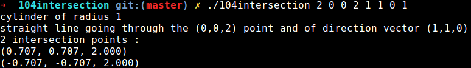

# 104intersection
Epitech first year project : [CPE] 104intersection
4th mathematic mudole project of the first year

Deadline : 2 weeks

Beginning of the project : 14/12/2015, 07h42

Group size : 2 person

Contributor : collet_j

# 104intersection

To code a software to create synthesis images (it may remind you something....), potential intersection points between light rays and scene objects (here cylinders, spheres and cones) must be computed.

This is exactly what you have to do.

To do so, you need to write a 3 dimensional equation of the straight line representing the light ray, and inject into it
the equation of the considered surface. You’ll get a quadratic equation, with 0, 1 or 2 solutions, that will give you the
intersection points coordinates (one do not take into account the possibility that the equation has an infinite number of solutions here).

The straight line is defined by the coordinates of a point by which it goes through and by the coordinates of a direction
vector.

## Getting started

These instructions will allow you to obtain a copy of the operational project on your local machine for development and testing purposes.

### Prerequisites

What do you need to install the software and how to install it?

```
gcc
make
```

### Installation

Here's how to start the project on your computer

Clone and go in the directory 104intersection

Project compilation

```
make
```

Running project

```
./104intersection  opt xp yp zp xv yv zv p
```

opt number of the option : 1 for a sphere, 2 for a cylinder, 3 for a cone 

(xp, yp, zp)  coordinates of the point by which the light ray goes through

(xv, yv, zv)  coordinates of the direction vector of the light ray

p parameter : radius of the sphere, radius of the cylinder  or angle formed by the cone and the Z-axis.


## Screenshot



## Build with

* [C](https://en.wikipedia.org/wiki/C_(programming_language))

## Auteurs

* **David Munoz** - [DavidMunoz-dev](https://github.com/davidmunoz-dev)
